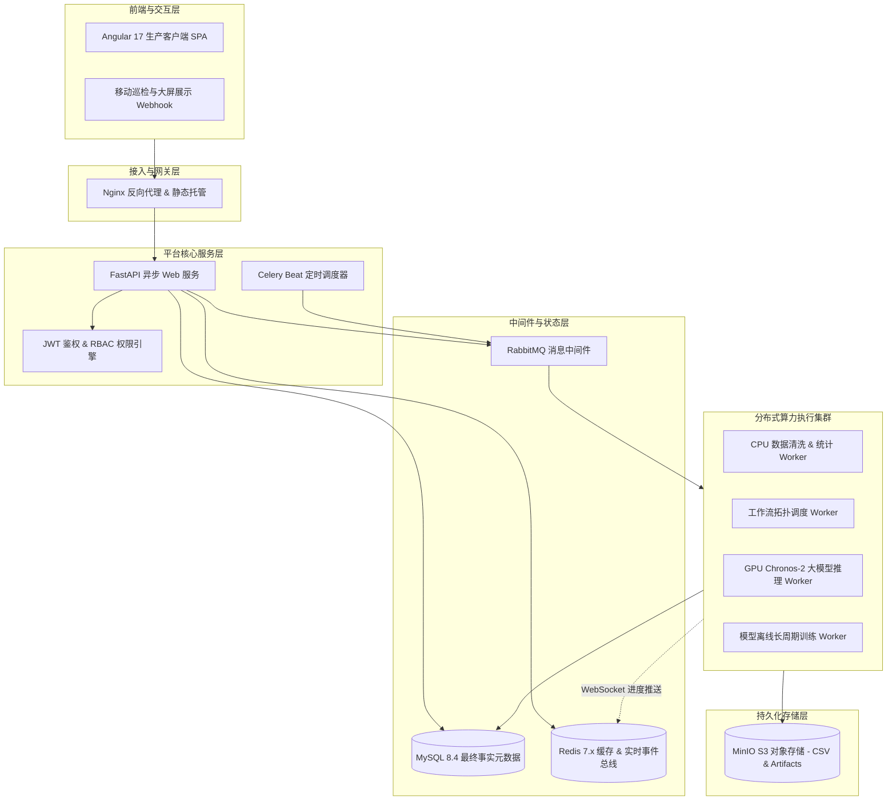

# 平台组成、数据流与运行架构

智慧水务算法平台基于“前后端分离 + 分布式异步计算集群 + S3 兼容对象存储”的工业级云原生架构构建，保障高并发水务时序数据吞吐与深度学习大模型计算的稳定性。

---

## 1. 总体分层拓扑架构

---

## 2. 端到端核心数据流向

1. **时序数据接入流**：
   - 业务人员上传 CSV 或接入只读 MySQL $\rightarrow$ API 暂存文件并进行头部采样 $\rightarrow$ 异步触发数据校验与入库 $\rightarrow$ 原始时序流持久化至 MinIO，元数据写入 MySQL；
2. **工作流编排与运行流**：
   - 用户在画布保存 DAG 并发布版本 $\rightarrow$ 触发运行 $\rightarrow$ API 写入执行实例记录并将任务推入 RabbitMQ `workflow` 队列；
   - 工作流调度器解析节点依赖，按拓扑序将各节点计算任务分派至 `cpu` 或 `gpu_inference` 队列；
3. **计算结果工件与可视化流**：
   - Worker 执行算子计算，将生成的时序预测曲线、漏损候选报告写入 MinIO $\rightarrow$ 更新节点状态至 MySQL $\rightarrow$ 通过 Redis 发布/订阅机制经 WebSocket 毫秒级推送到前端画布。
