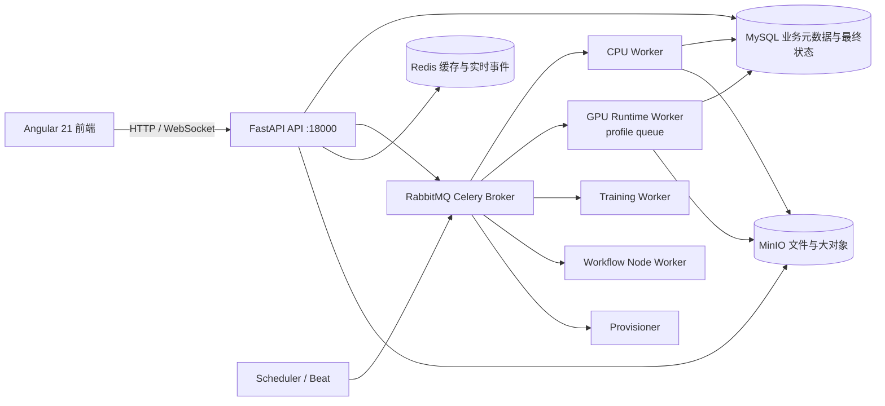

# 平台组成、数据流与运行架构

平台是前后端分离的模块化单体应用。Angular 21 前端通过 HTTP 和 WebSocket 访问 FastAPI；业务状态由 MySQL 保存，异步任务由 Celery 分发到 RabbitMQ，Redis 负责实时事件和缓存，MinIO 负责文件和大对象。平台当前面向可追溯的水务数据分析闭环，不承诺移动巡检、工单、通用高并发或毫秒级响应能力。

## 1. 运行拓扑

Scheduler/Beat 只负责把到期任务消息发布到 RabbitMQ；RabbitMQ 再把消息交给相应 Worker，不反向驱动 Scheduler。

生产部署使用独立的应用服务和基础设施服务。前端服务监听 `18001`，API 监听 `18000`；数据库、消息代理、缓存和对象存储不向浏览器开放，具体地址由服务器环境配置决定。

## 2. 组件职责

| 组件 | 平台职责 | 不负责的事情 |
| --- | --- | --- |
| Angular 21 | 登录、数据资产、算子、工作流、任务和结果页面 | 不直接连接数据库或对象存储 |
| FastAPI | 鉴权、权限检查、业务写入、查询和任务创建 | 不在 API 进程中执行上传算法包代码 |
| MySQL | 用户、权限、数据源、数据资产版本、工作流、任务、报告摘要和审计；任务终态的事实来源 | 不保存 CSV 原件、模型文件或大型 Artifact |
| RabbitMQ | 当前服务器的 Celery Broker，承载任务投递 | 不作为业务状态数据库 |
| Redis | 缓存、实时进度事件和 WebSocket 发布订阅 | 事件丢失时不改变 MySQL 中的业务终态 |
| MinIO | CSV 原件、算法 ZIP、模型、派生 Parquet、HTML 报告和大型 Artifact | 不由浏览器直接访问 |

## 3. 数据边界与数据流

1. 只读 MySQL 源和 CSV 上传都可形成平台数据资产。源库只执行读取；平台不会回写外部源库。
2. CSV 原件先写入 MinIO，映射和导入任务写入 MySQL。导入形成的版本标记为 `imported + mysql`，通过版本和通道接口读取。
3. 治理工作流不会修改父版本。派生版本完整物化为 MinIO Parquet，MySQL 保存父版本、任务、对象摘要和血缘。
4. API 在 MySQL 中创建任务和待分发记录，再尝试投递消息。Worker 执行后写回 MySQL；Redis 只用于刷新界面，断线后由任务接口恢复状态。
5. 普通 CPU 和工作流节点按拓扑顺序推进。遇到 GPU 节点时，协调器会创建一个独立的节点任务，父工作流等待节点完成后再继续；这不是把整个工作流改成通用并行执行。取消在节点边界协作收敛，单个 Python 调用不保证立即抢占。

## 4. 当前队列与运行边界

| 队列 | 用途 |
| --- | --- |
| `ingest` | CSV 和只读 MySQL 导入 |
| `quality` | 独立质量任务兼容入口 |
| `cpu_algorithm` | CPU 算法和历史 S01 入口 |
| `training_cpu` | 训练任务 |
| `workflow` | 工作流协调和顺序推进 |
| `workflow_node` | 工作流中的独立节点任务，当前用于 profile-backed GPU 节点 |
| `gpu_runtime_py312_torch28_cu128_v1` | 当前 GPU Runtime Profile 的诊断和 GPU 算法任务 |
| `gpu_algorithm` | 历史/兼容队列；当前 profile GPU Worker 不以它作为实际主消费队列 |
| `algorithm_management` | 算法包静态校验 |
| `algorithm_provisioning` | 外部算法运行环境制备和样例试运行 |
| `dataset_management` | 数据资产永久清除 |
| `system` | 分发扫描、心跳恢复和暂存清理 |

CPU、训练和 GPU 运行环境分离。GPU 诊断、GPU 算法和 profile-backed GPU 节点实际路由到 `gpu_runtime_py312_torch28_cu128_v1`；GPU 不可用时任务明确失败，不静默改用 CPU。外部算法包在当前兼容入口中由 `algorithm_management` 和 `algorithm_provisioning` 处理，仍不是默认业务入口。

## 5. 健康与部署边界

`GET /health/live` 只表示 API 进程存活；`GET /health/ready` 检查 MySQL、Redis、配置的 Celery Broker 和 MinIO，并单独报告可选 GPU 能力。部署脚本使用 `18000` 和 `18001` 做烟测。发布、迁移、重启和回退均按服务器脚本和人工确认执行，不把本架构描述为零停机或自动回滚系统。
