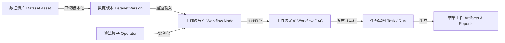

# 核心概念与系统对象模型

智慧水务算法平台围绕**“数据接入 → 算子编排 → 异步执行 → 结果溯源”**构建了清晰、解耦的实体对象模型。深入理解这些核心概念有助于高效使用平台功能与开展二次集成。

---

## 1. 数据资产 (Dataset Asset) 与只读版本 (Dataset Version)

- **数据资产 (Dataset Asset)**：水务管网监测时序数据的业务容器，通常对应一个物理测区、DMA 分区、水厂或监测站点（例如：`城东DMA-流量压力监测数据集`）；
- **数据通道 (Channel)**：资产内部的度量维度，如 `inflow`（入口流量）、`pressure`（管网末梢压力）、`authorized_consumption`（授权用水量）等；
- **只读不可变版本 (Immutable Version)**：
  - 导入的数据每次生成唯一且只读的版本标识（如 `v1`, `v2`）；
  - 平台严禁就地修改历史数据。任何清洗、去噪、对齐或插值操作，均通过工作流生成**派生数据资产版本**；
  - 平台自动记录数据版本之间的血缘演进关系（Lineage Tree）。

---

## 2. 算法算子 (Operator) 与参数规格 (Parameter Schema)

- **算法算子 (Operator)**：执行特定数据转换或分析计算的原子功能单元，具备独立的输入输出端口与参数声明；
- **算子契约 (Contract)**：
  - **输入端口 (Input Ports)**：声明所需要的数据类型（如 `timeseries`、`dataframe`、`model`、`scalar`）与约束；
  - **输出端口 (Output Ports)**：声明计算产出的数据类型与 Artifact 格式；
  - **参数规格 (Parameter Schema)**：使用 JSON Schema (Draft 2020-12) 定义算子的配置参数、类型约束、默认值与合法取值范围。
- **算子发布版本**：算子代码与环境严格锁定，发布后不可篡改，确保下游依赖稳定性。

---

## 3. 工作流 (Workflow DAG) 与节点 (Node)

- **工作流 (Workflow)**：由多个算子节点及它们之间的有向连接组成的**有向无环图 (DAG)**；
- **节点 (Node)**：算子在工作流中的实例化对象，包含节点特有的配置参数覆写（Parameter Override）与数据绑定；
- **图校验 (Graph Validation)**：
  - 在发布前，系统自动执行 DAG 连通性、环路检测、类型兼容性与必填参数完整性检查；
- **草稿态与发布态**：
  - **草稿 (Draft)**：支持交互式拖拽、调参和试运行；
  - **发布版本 (Published Release)**：校验通过后冻结的生产版本，锁定所有节点的算子版本号与连接拓扑。

---

## 4. 任务实例 (Task / Run) 与结果工件 (Artifacts)

- **任务实例 (Task / Execution Run)**：工作流发布版本在特定数据输入下的异步执行实例；
- **执行生命周期**：
  - `PENDING`（排队等待） → `RUNNING`（异步 Worker 执行中） → `SUCCESS`（执行成功）/ `FAILED`（异常中断）；
- **全局追踪标识 (Trace ID)**：每个任务分配全局唯一的 `trace_id`，贯穿 API、Worker 调度、节点标准日志与结果归档；
- **结果工件 (Artifacts)**：节点执行产出的时序折线数据、DMA 漏损候选清单、质量评估雷达图或统计汇总表，按版本持久化保存在对象存储（MinIO）中。
