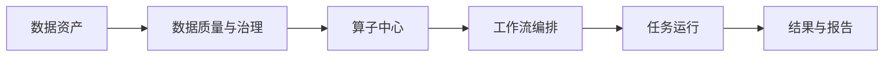

# 平台总体架构与能力地图

## 平台用途

智慧水务算法平台面向时序数据分析场景，将数据接入、质量治理、算子组合、异步运行和结果查看组织为可追溯的分析闭环。使用者不需要记忆内部数据版本标识；平台在运行记录中保留数据、算子、参数和结果之间的关联。

## 能力地图

| 能力 | 说明 |
| --- | --- |
| 数据资产 | 上传 CSV 或接入只读数据源，管理不可变数据版本。 |
| 算子中心 | 查看内置分析算子的输入、输出、参数、运行环境和文档。 |
| 工作流 | 通过节点与连接组织数据处理和算法分析步骤。 |
| 任务中心 | 查询运行状态、日志、重试信息与结果追溯。 |

## 下一步指引

- **快速上手**：参考 [从上传 CSV 到运行第一个质量分析工作流](/docs/quick-start/quickstart.first-quality-workflow)，在 5 分钟内创建并运行首个分析流；
- **探索算法**：查阅 [Chronos-2 时序预测](/docs/algorithms/algorithm.chronos2.overview) 与水务算法模型库；
- **业务场景**：了解 [S01 DMA 漏损评估流程与结果解释](/docs/scenarios/scenario.s01-dma-leakage)；
- **开发者与 API**：查阅 [登录认证与调用第一个 API](/docs/development/development.first-api-call)。
