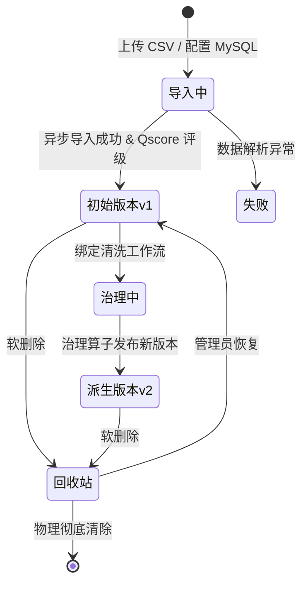

# 数据、工作流、任务和账户生命周期

---

## 1. 数据资产生命周期

- **不可变原则**：已生成的版本数据只读锁定，任何变更均产生新版本（如 `v2`）；
- **软删除与保护**：被已发布工作流引用的数据版本禁止物理删除，删除操作统一进入回收站。

---

## 2. 任务执行状态机 (Task Execution Lifecycle)

- `PENDING`：任务已入队，等待可用 Worker 资源；
- `RUNNING`：Worker 正在执行节点算子计算；
- `SUCCESS`：全节点成功完成并归档 Artifacts；
- `FAILED`：由于输入类型错误、数据缺失超限或算子异常导致任务终止；
- `CANCELLED`：用户或管理员主动中断执行。

---

## 3. 用户账户生命周期

- `REGISTERED`（待审批/活跃） $\rightarrow$ `ACTIVE`（正常登录操作） $\rightarrow$ `SUSPENDED`（管理员冻结） $\rightarrow$ `DELETED`（软注销并解除资源归属）。
