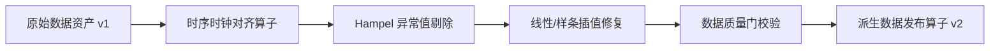

# 从原始数据生成治理派生版本

原始管网传感器数据常存在采样频率不一致、时钟漂移、瞬时通信丢包（缺失值）与异常毛刺。平台通过可视化的数据治理工作流，将原始脏数据转换为标准、干净且带血缘追踪的派生版本。

---

## 治理链路拓扑

---

## 操作步骤

1. **新建数据治理工作流**：
   - 进入【工作流编排】，点击【新建空白工作流】，命名为 `DMA-时序数据清洗与治理流程`；
2. **编排治理算子**：
   - 从左侧算子目录依次拖入以下节点：
     - `整体数据资产绑定` (`dataset_asset_v1`)
     - `时序对齐` (`align_timeseries_v1`，设置重采样步长为 `15min`)
     - `异常值检测与处理` (`outlier_repair_dataset_v1`，配置窗口为 `12`，阈值为 `3.0`)
     - `缺失值修复` (`missing_value_repair_dataset_v1`，选择插值方法 `linear`)
     - `派生数据版本发布` (`dataset_publish_v1`)
3. **完成端口连线**：
   - 依次将各节点的输出 `timeseries` 端口连接至下游节点的输入端口；
4. **运行并生成派生资产**：
   - 点击【保存】与【校验图】，通过后点击【运行】；
   - 运行完成后，进入【数据资产】页面，即可看到原始数据资产下自动生成了 `v2 (派生版本)`，并可在【血缘关系】选项卡中查阅完整的转换链路。
