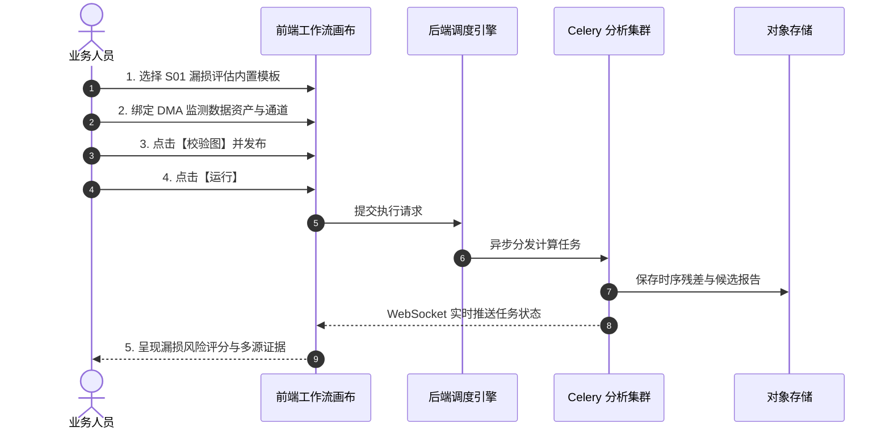

# 使用内置结构完成一次 DMA 漏损评估

S01 漏损评估是智慧水务算法平台针对供水管网分区计量（DMA，District Metering Area）打造的标准漏损筛查链路。本指南将引导您在 10 分钟内完成一次完整的漏损分析任务。

---

## 前置准备

- 已准备包含入口流量（`inflow`）、合法夜间用水（`night_flow`）与授权用水量（`authorized_consumption`）的 CSV 监测数据；
- 用户具备工作流执行与数据查看权限。

---

## 操作步骤

1. **导入管网监测数据**：进入【数据源与导入】，上传包含流量与用水时序的 CSV 文件并完成导入；
2. **加载内置模板**：进入【工作流编排】，点击【从模板新建】，选择 `S01 DMA 漏损筛查全链路模板`；
3. **配置数据资产输入节点**：
   - 点击画布起点的 `数据资产输入` 节点；
   - 在右侧属性面板选择刚刚导入的数据资产版本，并将输出通道分别映射到入口流量与授权用水；
4. **校验并发布工作流**：点击右上角【校验图】，确认无端口或参数报错后，点击【发布版本】；
5. **触发运行与查看进度**：点击【运行此版本】，系统将自动跳转至运行实例详情页；
6. **解读评估结果**：
   - 任务完成后，在详情页查看 `漏损评估综合报告`；
   - 检视各个候选时段的综合风险评分（`risk_score` 0~100）、水量平衡失衡度与最小夜间流量（MNF）异常偏离曲线。

---

## 结果分析与下一步行动

- 若某时段 `risk_score > 75`，表明水量平衡残差与夜间流量同时出现异常突增，建议导出异常时间段数据并联动现场巡检人员进行听漏排查。
