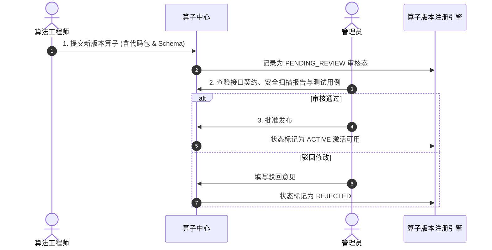

# 算法发布、审核、激活和回滚

为保障生产环境工作流运行稳定性，平台对算法与算子的升级实行严格的**“研发提交 $\rightarrow$ 管理员审核 $\rightarrow$ 生产激活”**四眼原则管控。

---

## 1. 算法发布审批全流程

---

## 2. 生产版本激活与紧急回滚

- **多版本并存**：新版本激活后，历史版本仍保持可用，避免破坏依赖旧版本的历史工作流；
- **紧急停用与回滚**：若新版本在生产运行中出现非预期缺陷，管理员可一键将其标记为 `DEPRECATED`（弃用），工作流将自动回退调用最近的稳定版。
