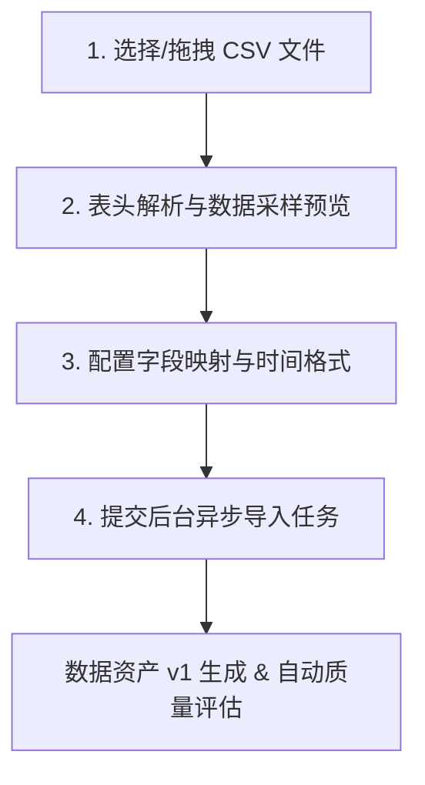

# CSV 上传、预览、字段映射与导入

平台支持将供水/排水管网、泵站、水厂的离线 CSV 时序监测数据快速接入为标准数据资产。导入过程包括文件解析、表头匹配、通道映射与后台数据质量自动评估。

---

## 1. CSV 文件格式规范

- **文件编码**：推荐 UTF-8 或 GBK；
- **分隔符**：标准英文逗号 `,`；
- **必备列要求**：
  1. **时间戳列**：包含标准时序时间（如 `2026-08-01 00:00:00`，推荐 ISO 8601 或 `%Y-%m-%d %H:%M:%S` 格式）；
  2. **数值指标列**：如入口流量 `inflow` ($m^3/h$)、压力 `pressure` ($MPa$) 等浮点数值列；
  3. **测点标识列（可选）**：如 DMA 分区编码 `dma_code` 或测点 ID。

---

## 2. 四步导入流程

1. **选择上传文件**：
   - 进入【数据管理】→【数据源与导入】，点击【上传 CSV】；
   - 拖拽或选择本地 CSV 文件，系统自动完成文件头部扫描；
2. **数据采样预览**：
   - 界面实时展示前 10 行采样数据，核对列名与数值解析是否正确；
3. **配置字段映射 (Field Mapping)**：
   - **时间列映射**：指定哪个字段作为时间索引，并选定对应的时间解析格式；
   - **通道指标映射**：将 CSV 中的数据列分别绑定到标准通道，例如：
     - `瞬时流量_m3h` → 映射为 `inflow` 通道；
     - `出厂压力_MPa` → 映射为 `pressure` 通道；
4. **提交导入并生成资产**：
   - 填写资产名称（如 `城南主干管-2026年8月时序监测`）；
   - 点击【开始导入】，后台 Celery Worker 将异步执行全量数据入库，并自动触发数据质量雷达评估。
