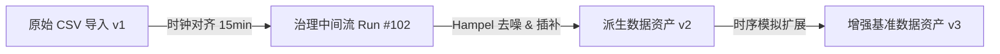

# 数据版本血缘树与历史版本查看

数据血缘（Lineage）记录了数据资产从原始采集接入，到经过各类清洗、去噪、对齐、插补和特征工程算子处理的全流程演进图谱。

---

## 1. 交互式血缘关系树

在数据资产详情页点击【血缘关系】选项卡，界面呈现以 DAG 节点形式渲染的可视化血缘树：

---

## 2. 血缘节点详情与版本对比

- **点击血缘节点**：可查阅生成该版本的具体工作流运行实例（`run_id`）、使用的算子版本参数快照及执行人员；
- **多版本数据质量对比**：并排对比原始版本（`v1`）与派生版本（`v2`）的 Qscore 雷达得分、缺失值占比与异常毛刺剔除数量，量化评估数据治理效果。
