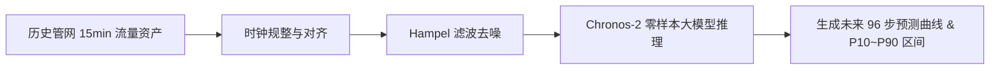

# 15 分钟管网流量预测场景与结果解释

高精度的未来流量预测是水厂精准加压、节能降耗与泵房优化调度的核心基础。

---

## 1. 业务流程拓扑

---

## 2. 预测结果解读

- **点预测 (P50 期望曲线)**：代表最可能的真实用水走势，用于指导次日各时段总供水调度计划；
- **不确定性区间 (P10 与 P90 上下界)**：反映早高峰、晚高峰与极端天气下的用水波动范围，若实测流量向上击穿 P90，可即时触发突发用水或暗漏预警。
