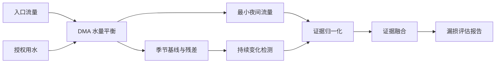

# S01 DMA 漏损评估流程与结果解释

## 适用范围

S01 用于 DMA 范围内的漏损筛查。它输出需要进一步核验的风险时段，而不是管段级精确漏点或自动维修结论。

## 输入

基础流程需要入口流量、授权用水和合法夜间用水；压力增强流程还需要压力时序。各通道应具有一致或可显式对齐的时间范围与单位。

## 分析流程

## 结果解释

候选的 `risk_score` 表示该候选时段的最高风险分数；报告同时保留平均风险和证据构成。风险分数用于排序和筛查，应结合现场巡检、阀门工况、施工记录和计量异常进行人工核验。
