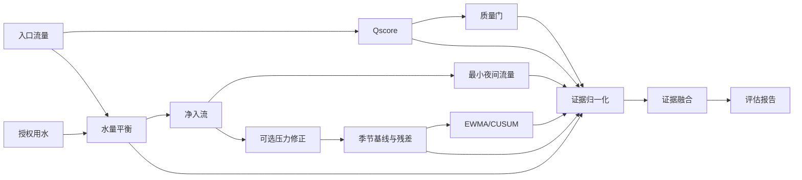

# S01 DMA 漏损评估流程与结果解释

## 用途与适用范围

S01 用于 DMA 范围内的漏损风险筛查。它输出需要进一步核验的 DMA 级候选时段，不输出管段级精确漏点、已证明的漏损量、自动告警工单或自动派发结果。

## 输入与前置条件

必需绑定 `inlet_flow`、`authorized_consumption` 和 `legitimate_night_use`；可选 `outlet_flow`、`known_losses` 和一个 `pressure` 通道。绑定值来源只能是 `raw` 或 `processed`，通道需按时间对齐，流量为 `m3/h`，压力为声明的单位。DMA 时区用于夜间窗口和本地日映射。

## 分析流程

固定管线先对入口流量运行 Qscore，默认质量门为 `60`；随后计算水量平衡和 MNF，有压力时才运行压力修正，再运行季节滞后基线、EWMA/CUSUM 和证据融合。固定管线中的归一化使用配置参考值，未配置时按当前数据第 95 百分位；融合默认权重为夜间 `0.30`、平衡 `0.30`、残差 `0.25`、持续变化 `0.15`。

## 结果解释与限制

候选由质量分、四类归一化证据、质量门槛 `0.6`、风险阈值 `0.65` 和至少 4 个连续点共同决定。`risk_score` 是 `[0,1]` 的排序信号，不是漏损概率。现场人员仍需结合阀门工况、计量异常、施工记录和巡检确认；路线图明确当前方案没有拓扑、压力校准和现场真值时不能定位具体管段。

候选状态可以由有权限的业务流程人工管理；S01 算法本身不自动产生告警工单或派发任务。

## 参考资料

本场景采用平台确定性的 S01 组合规则，无单独外部论文基准。
