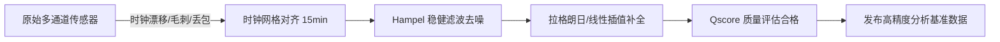

# 多通道时序数据质量分析与治理场景

在水务物联网实际生产环境中，不同厂商的传感器常常存在采样时钟不同步、网络丢包与电磁干扰。本场景阐述如何利用平台治理算子流构建标准化治理流水线。

---

## 业务痛点与治理方案

```mermaid
flowchart LR
    A[原始多通道传感器] -->|时钟漂移/毛刺/丢包| B[时钟网格对齐 15min]
    B --> C[Hampel 稳健滤波去噪]
    C --> D[拉格朗日/线性插值补全]
    D --> E[Qscore 质量评估合格]
    E --> F[发布高精度分析基准数据]
```
