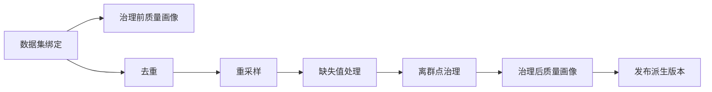

# 多通道时序数据质量分析与治理场景

## 用途与适用范围

基础治理模板以整个数据集为单位处理多个通道：先画像，再依次去重、重采样、缺失值处理和离群点治理，最后再次画像并发布派生版本。它适合形成可追溯的分析输入，不保证处理后数据满足某个业务算法的全部要求。

## 输入与前置条件

入口是一个数据集绑定。数据集包包含通道的点位、指标、单位、时间和值；各治理变换对每个通道独立执行。发布前必须已有变换产生的 stage；未生成 stage 时不能发布。

## 基础治理链

治理前画像与去重分支并行；画像不会自动阻断后续处理。默认参数为：质量画像期望间隔 `900` 秒；去重保留重复时间戳的 `last` 行；按 `900` 秒和 `mean` 重采样；线性处理最多填补 `8` 个点的内部缺失；离群点使用窗口 `7`、阈值 `3.0`、动作 `flag_only`。`flag_only` 只写入标记，不替换值。

## 结果与数据边界

质量画像输出治理前、治理后报告；报告包含总分、A/B/C/D 等级、五维维度、问题计数和通道明细。各变换输出临时 stage；发布输出一个 `derived` 数据集版本，带有父版本关系和版本备注。父版本和原始观测不会被覆盖。

## 限制与失败处理

质量画像的 `expected_interval_seconds=0` 表示不做时间间隔检查。重采样不会填补缺失，缺失处理也不会替换未覆盖的方法；离群治理只有显式选择 `median` 或 `interpolate` 才会替换值。未知参数、无效窗口或无效动作会使相应节点失败；没有 stage 的发布会失败。治理结果仍需根据治理后报告和下游算法要求人工判断。

## 参考资料

本场景采用平台确定性的多通道治理组合规则，无单独外部论文基准。
