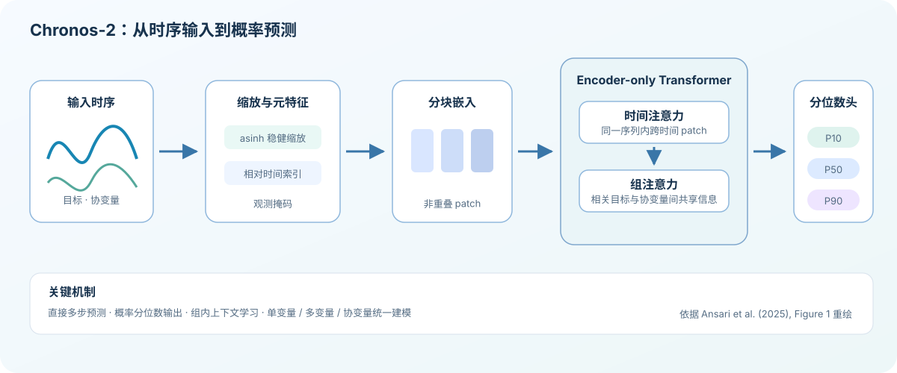

# Chronos-2 时序预测

## 用途与适用范围

Chronos-2 是面向时序预测的预训练零样本模型。原始模型可以面向单变量、多变量和协变量进行概率预测；平台当前登记的 `chronos2_flow_forecast` 是一个 GPU 算子，只把单变量流量序列接入模型，输出未来流量点预测和 P10/P50/P90 分位数。

当前算子适合在流量等连续数值序列上建立预测参考。它是 `candidate` 能力，不能据此断言在某个 DMA 上优于专用基线或已达到业务准确率。

## 输入与输出

平台当前输入是按时间升序排列的 `time`、`value` 两列单变量序列。时间戳必须唯一、有效且为严格的 15 分钟间隔；值不能缺失。任务加载数据时的 `value_source` 可配置为 `raw` 或 `processed`，默认使用算法登记的 `processed`。

输出包含长度为 `horizon` 的 `values`，以及 `quantiles` 中的 `0.1`、`0.5`、`0.9` 三组预测；同时提供 `lower`（P10）和 `upper`（P90）。每个未来时间点由算子按 15 分钟间隔生成。输出元数据包括模型名、采样间隔、`horizon` 和 `context_length`。

原始模型的多变量、协变量和更多分位数能力不属于当前算子输入输出契约，不能在平台工作流中假定可用。

## 原理与关键公式

对长度为 $T$ 的历史目标序列 $y_{1:T}$ 和预测长度 $H$，概率预测目标可写为：

$$
P(y_{T+1:T+H}\mid y_{1:T})
$$

模型从历史上下文生成未来分布；平台取固定的 0.1、0.5、0.9 分位数。P50 是中位预测，P10 与 P90 构成模型给出的区间边界，不是覆盖真实值的保证。

*图：Chronos-2 原始模型结构示意；图示不扩展平台当前单变量算子契约。*

## 参数说明

| 参数 | 默认值 | 说明 |
| --- | ---: | --- |
| `horizon` | `96` | 预测点数，允许范围 `1–96`。 |
| `context_length` | `288` | 使用的历史点数，允许范围 `96–4096`；输入至少要有这么多有效观测。 |
| `value_source` | `processed` | 数据集值来源；可选 `raw` 或 `processed`。它决定读取哪一列已登记的值，不是模型参数。 |

模型调用的分位数集合固定为 `[0.1, 0.5, 0.9]`，当前不作为用户参数开放。

## 结果解释与限制

- GPU、Chronos 运行时、默认模型和严格的 15 分钟时间间隔任一不满足时，算子会失败，不回退到 CPU。
- 长缺失、异常值、时间不规则和分布漂移会影响结果；输入治理应在预测前完成。
- P10–P90 只表达模型输出的不确定性，不能解释为真实值必然落入区间。
- 预测结果应与 `seasonal_naive` 等基线在相同留出窗口上比较后再决定是否使用。
- 原始论文或公开基准不替代具体水务数据上的留出评估；当前路线图要求真实 GPU 和水务留出验证完成前保持 candidate。

## 参考资料

- [Chronos-2: From Univariate to Universal Forecasting](https://arxiv.org/abs/2510.15821)（原始模型能力说明）。
- [Chronos 官方实现](https://github.com/amazon-science/chronos-forecasting)。
- 平台当前算子契约：单变量、15 分钟间隔、`horizon`/`context_length`/`value_source` 参数和固定 P10/P50/P90 输出；无单独外部性能基准。
