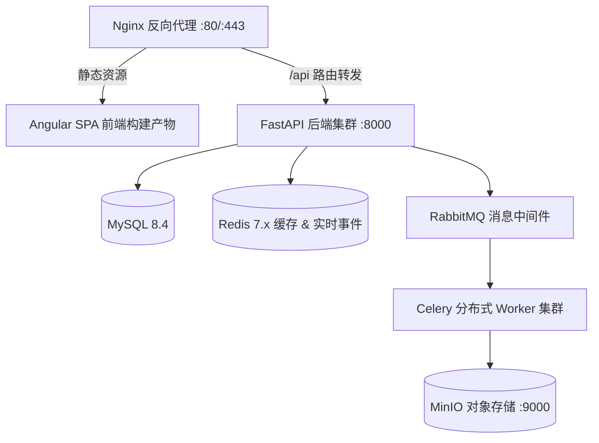

# 前后端统一部署、升级与回退

智慧水务算法平台支持基于生产发布脚本 `deploy.sh` 进行原子化一键升级、数据库幂等迁移与自动化冒烟测试（Smoke Test）。

---

## 1. 生产环境部署架构



---

## 2. 自动化部署流程 (`deploy.sh`)

在生产部署服务器（如 `smart-water-server`）上执行一键部署：

```bash
# 进入发布目录并执行部署
cd /opt/smart-water-platform/backend/deploy
./deploy.sh
```

### 部署脚本执行步骤：
1. **环境依赖预检**：检查 Python 3.12、Node.js 20+、Docker、Systemd 服务状态与环境变量 `.env`；
2. **数据安全备份**：自动导出当前数据库快照至 `/backup/mysql_pre_deploy.sql`；
3. **数据库迁移 (Alembic)**：执行 `alembic upgrade head`，应用最新表结构与初始种子数据；
4. **前端构建与同步**：构建 Angular 生产产物并同步至 `/var/www/smart-water-frontend`；
5. **服务热重载**：重启 `smart-water-api` 与各队列 `smart-water-worker@*` Systemd 服务；
6. **自动化 Smoke Test 校验**：向 `/health/ready` 与 `/api/v1/auth/health` 发起探针检测，若异常则自动告警并支持一键回退。

---

## 3. 版本回滚指南 (Rollback)

若新版本部署后出现不可恢复故障，执行回退操作：
```bash
./deploy.sh --rollback <PREVIOUS_RELEASE_TAG>
```
脚本将自动恢复旧版前端静态资源软链接、恢复数据库快照并重启旧版 Worker 服务。
